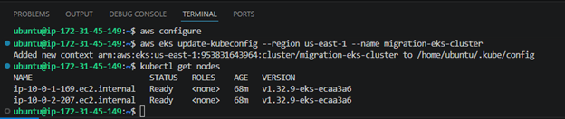
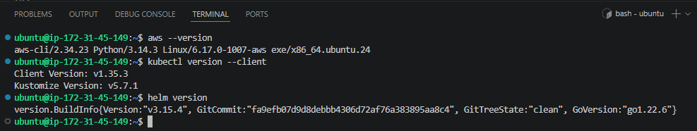
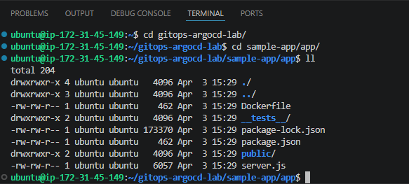
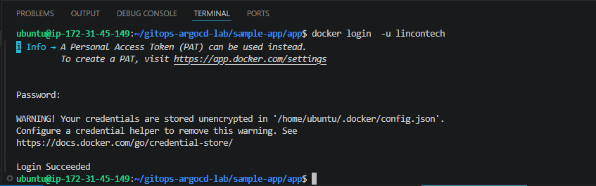
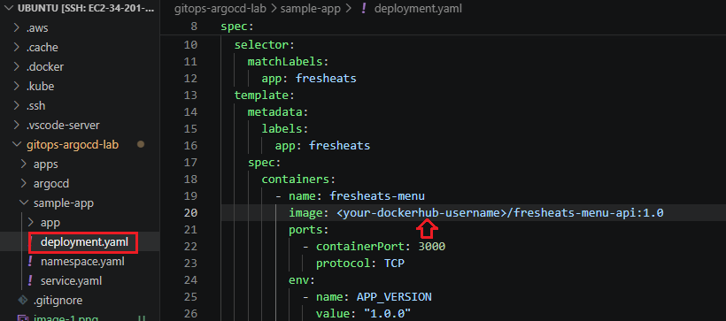
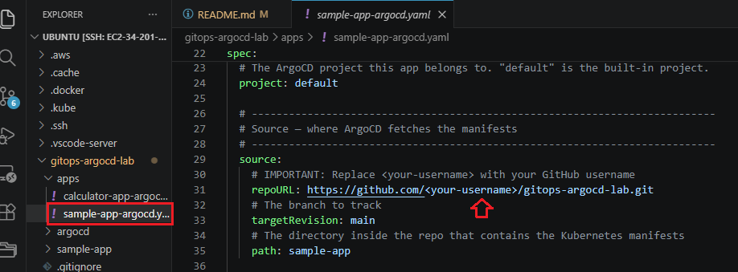

# GitOps with ArgoCD Lab — FreshEats Food & Beverage Platform

A hands-on GitOps lab where students deploy and manage a food and beverage ordering platform using **ArgoCD** on AWS EKS. Instead of manually running `kubectl apply` to deploy changes, students push code to Git and watch ArgoCD automatically sync the cluster to match -- the core principle of GitOps.

## Scenario

You are a DevOps engineer at **FreshEats**, a growing food and beverage company that operates digital ordering kiosks in restaurants, food courts, and cafeterias. The company's menu API powers the kiosks -- customers browse the menu, place orders, and track their order status in real time.

Until now, the team has been deploying manually: someone SSHes into a server or runs `kubectl apply` from their laptop. This has caused problems:

- **A developer accidentally deployed a broken version to production** during Friday lunch rush, taking down the ordering system for 20 minutes. Revenue was lost and customers left.
- **Nobody knows what's running in production.** When the VP of Operations asks "what version is live right now?", the team has to SSH into pods to check.
- **A junior engineer manually scaled the replicas from 2 to 10** to handle a catering event, but forgot to scale back down. The company got an unexpected AWS bill.

Management has asked you to implement **GitOps** to solve these problems. With GitOps:

- **Git is the single source of truth.** To know what's running in production, just look at the `main` branch.
- **All changes go through Git.** No more `kubectl apply` from laptops. Every change is reviewed, tracked, and reversible.
- **ArgoCD automatically syncs the cluster.** Push a change to Git, and ArgoCD deploys it within minutes -- no human intervention needed.
- **Self-healing.** If someone manually changes something in the cluster, ArgoCD detects the drift and reverts it back to what Git says.

## What is GitOps? (Plain English)

Traditional deployment: a person runs commands to push code to a server. If something goes wrong, it's hard to know what changed or who changed it.

**GitOps flips this around.** Instead of *pushing* changes to the cluster, you *describe* the desired state in Git, and a tool (ArgoCD) *pulls* those changes and applies them automatically.

Think of it like a thermostat:
- You set the desired temperature (the Git repository says "2 replicas, version 1.0, 256Mi memory")
- The thermostat (ArgoCD) constantly checks the actual temperature (the cluster state)
- If there's a difference, it adjusts automatically (syncs the cluster to match Git)

**Four principles of GitOps:**

| Principle | What It Means | FreshEats Example |
|---|---|---|
| **Declarative** | You describe *what* you want, not *how* to get there | "I want 3 replicas of the menu API" -- not "SSH into the server and start 3 processes" |
| **Versioned** | Every change is a Git commit with a history | "Version 1.2 was deployed at 2pm by Sarah" -- visible in `git log` |
| **Pulled automatically** | The system pulls changes from Git, not pushed by humans | ArgoCD checks the repo every 3 minutes and applies any new changes |
| **Self-healing** | The system corrects any drift between Git and reality | If someone manually deletes a pod, ArgoCD recreates it within minutes |

## What Gets Created

- **ArgoCD** -- Installed on EKS via Helm with a LoadBalancer UI. This is the "thermostat" that watches Git and keeps the cluster in sync.
- **FreshEats Menu API** -- A Node.js food ordering application with a digital menu, order placement, order status tracking, and a customer-facing dashboard UI.
- **ArgoCD Application CR** -- A custom resource that tells ArgoCD: "watch this Git repo, and deploy whatever Kubernetes manifests you find in the `sample-app` directory."
- **Kubernetes Resources** -- Namespace, Deployment (2 replicas), and LoadBalancer Service, all managed by ArgoCD.

## Architecture

```
 ┌─── Developer Workflow ──────────────────────────────────────────────────────────────┐
 │                                                                                      │
 │   Developer changes code or K8s manifests                                           │
 │          │                                                                           │
 │          ▼                                                                           │
 │   ┌──────────────┐     ┌──────────────────┐                                        │
 │   │  git commit   │────▶│  git push to     │                                        │
 │   │  git push     │     │  main branch     │                                        │
 │   └──────────────┘     └────────┬─────────┘                                        │
 │                                  │                                                   │
 └──────────────────────────────────┼───────────────────────────────────────────────────┘
                                    │
                                    ▼
 ┌─── GitHub Repository ───────────────────────────────────────────────────────────────┐
 │                                                                                      │
 │   gitops-argocd-lab/                                                                │
 │   ├── sample-app/                   ◄── ArgoCD watches this directory               │
 │   │   ├── namespace.yaml                                                            │
 │   │   ├── deployment.yaml           (replicas, image version, resources)            │
 │   │   └── service.yaml                                                              │
 │   └── apps/                                                                         │
 │       └── sample-app-argocd.yaml    (ArgoCD Application CR)                         │
 │                                                                                      │
 └──────────────────────────────────┬───────────────────────────────────────────────────┘
                                    │
                          ArgoCD polls every 3 min
                                    │
                                    ▼
 ┌─── EKS Cluster ─────────────────────────────────────────────────────────────────────┐
 │                                                                                      │
 │  ┌─── Namespace: argocd ────────────────────────────────────────────────────────┐    │
 │  │                                                                              │    │
 │  │   ┌────────────────────────────────────────────────────────────────────┐     │    │
 │  │   │  ArgoCD Server                                                     │     │    │
 │  │   │  ┌──────────────────┐  ┌───────────────────┐  ┌────────────────┐  │     │    │
 │  │   │  │  UI Dashboard    │  │  Repo Server      │  │  Application   │  │     │    │
 │  │   │  │  (LoadBalancer)  │  │  (clones Git      │  │  Controller    │  │     │    │
 │  │   │  │  Shows app       │  │   repos, reads    │  │  (compares     │  │     │    │
 │  │   │  │  status, sync    │  │   manifests)      │  │   desired vs   │  │     │    │
 │  │   │  │  history, diff   │  │                   │  │   actual state │  │     │    │
 │  │   │  └──────────────────┘  └───────────────────┘  │   and syncs)   │  │     │    │
 │  │   │                                               └────────────────┘  │     │    │
 │  │   └────────────────────────────────────────────────────────────────────┘     │    │
 │  │                                                                              │    │
 │  └──────────────────────────────────────────────────────────────────────────────┘    │
 │                                                                                      │
 │  ┌─── Namespace: fresheats-ns (managed by ArgoCD) ─────────────────────────────┐    │
 │  │                                                                              │    │
 │  │   ┌──────────────────┐  ┌──────────────────┐                                │    │
 │  │   │  Pod 1           │  │  Pod 2           │   ◄── 2 replicas              │    │
 │  │   │  fresheats-menu  │  │  fresheats-menu  │       (change in Git to       │    │
 │  │   │  :1.0            │  │  :1.0            │        scale up or down)      │    │
 │  │   │  /health ✓       │  │  /health ✓       │                                │    │
 │  │   └────────┬─────────┘  └────────┬─────────┘                                │    │
 │  │            └──────┬──────────────┘                                           │    │
 │  │                   ▼                                                          │    │
 │  │   ┌──────────────────────────────┐                                           │    │
 │  │   │  Service: fresheats-service  │                                           │    │
 │  │   │  Type: LoadBalancer          │                                           │    │
 │  │   │  Port: 80 → 3000            │                                           │    │
 │  │   └──────────────┬───────────────┘                                           │    │
 │  │                  │                                                           │    │
 │  └──────────────────┼───────────────────────────────────────────────────────────┘    │
 │                     │                                                                │
 └─────────────────────┼────────────────────────────────────────────────────────────────┘
                       │
                       ▼
              ┌──────────────────┐
              │  Restaurant      │
              │  Kiosks &        │
              │  Customers       │
              └──────────────────┘
```

## Prerequisites
```
Setting up your environment
    Spin up an EC2 instance with the following specifications
•	Instance name: Argo-CD-Lab
•	AMI: Ubuntu
•	Instance type t2 medium
•	Create or use an existing keypair
•	Use an existing VPC and subnet (default)
•	Storage: 20GB
•	Click the link below to copy user data
https://github.com/anmutetech/awstraining/blob/dockerlab/setup/k8s-lab/k8s-prerequisites
•	Connect to the instance via VScode
```

### 1. EKS Cluster

This project deploys to the `migration-eks-cluster` provisioned by the [Cloud Migration Infrastructure](https://github.com/anmutetech/cloud-migration-infra) setup.

Verify your cluster is running:

```bash
kubectl get nodes
```


### 2. Tools

```bash
aws --version
kubectl version --client
helm version
```


### 3. DockerHub Account

You need a [DockerHub](https://hub.docker.com/) account to push the FreshEats container image.

## Setup Guide

### Step 1 — Fork and Clone the Repository

1. Fork this repository to your own GitHub account
2. Clone your fork:

```bash
git clone https://github.com/<your-username>/gitops-argocd-lab.git
cd gitops-argocd-lab
```

### Step 2 — Build and Push the FreshEats Image

```bash
cd sample-app/app

docker build -t <your-dockerhub-username>/fresheats-menu-api:1.0 .
Login to docker <docker login -u username>

docker push <your-dockerhub-username>/fresheats-menu-api:1.0
cd ../..
```

### Step 3 — Update the Manifest References

Edit `sample-app/deployment.yaml` and replace the image placeholder with your DockerHub username:

```yaml
image: <your-dockerhub-username>/fresheats-menu-api:1.0
```


Also edit `apps/sample-app-argocd.yaml` and replace `<your-username>` with your GitHub username:

```yaml
repoURL: https://github.com/<your-username>/gitops-argocd-lab.git
```


Commit and push:

```bash
git add .
git commit -m "Configure image and ArgoCD repo URL"
git push origin main
```

### Step 4 — Install ArgoCD on the Cluster

```bash
chmod +x argocd/install.sh
./argocd/install.sh
```

This script:
1. Adds the ArgoCD Helm chart repository
2. Installs ArgoCD into the `argocd` namespace
3. Waits for the ArgoCD server pod to be ready
4. Prints the initial admin password

### Step 5 — Access the ArgoCD Dashboard

Get the ArgoCD UI URL:

```bash
kubectl get svc argocd-server -n argocd -o jsonpath='{.status.loadBalancer.ingress[0].hostname}'
```

Open the URL in your browser (it may take 2-3 minutes for DNS to resolve).

Log in with:
- **Username:** `admin`
- **Password:** (printed by the install script, or retrieve it with the command below)

```bash
kubectl -n argocd get secret argocd-initial-admin-secret -o jsonpath="{.data.password}" | base64 -d
```

You should see an empty ArgoCD dashboard -- no applications deployed yet.

### Step 6 — Deploy the FreshEats App via ArgoCD

This is the key GitOps step. Instead of running `kubectl apply` to deploy the app, you tell ArgoCD to manage it:

```bash
kubectl apply -f apps/sample-app-argocd.yaml
```

Now go back to the ArgoCD dashboard. You should see the **fresheats-menu** application appear. Click on it to see:

- The **sync status** (Synced = Git matches the cluster)
- The **health status** (Healthy = all pods are running)
- A **visual map** of all Kubernetes resources (namespace, deployment, replicaset, pods, service)

### Step 7 — Access the FreshEats Menu

Get the FreshEats service URL:

```bash
kubectl get svc fresheats-service -n fresheats-ns
```

Open the `EXTERNAL-IP` in your browser. You should see the FreshEats digital menu with:
- 10 menu items across 4 categories (Mains, Starters, Beverages, Desserts)
- Prices, calorie counts, prep times, and allergen information
- A "Served By" field showing which pod handled the request (refresh to see load balancing)

Test the API:

```bash
# Browse the full menu
curl http://<EXTERNAL-IP>/api/menu

# Filter by category
curl http://<EXTERNAL-IP>/api/menu?category=Beverages

# Place an order
curl -X POST http://<EXTERNAL-IP>/api/orders \
  -H "Content-Type: application/json" \
  -d '{"customerName": "Table 5", "tableNumber": 5, "items": [{"menuItemId": 1, "quantity": 2}, {"menuItemId": 6, "quantity": 3}]}'

# Check all orders
curl http://<EXTERNAL-IP>/api/orders
```

### Step 8 — Make a Change via GitOps (Auto-Sync)

This is where GitOps comes alive. The lunch rush is coming and the operations manager wants to scale from 2 to 4 replicas.

**The old way:** Someone runs `kubectl scale deployment fresheats-menu --replicas=4 -n fresheats-ns` from their laptop. No record of who did it or why.

**The GitOps way:**

1. Edit `sample-app/deployment.yaml` and change `replicas: 2` to `replicas: 4`
2. Commit and push:

```bash
git add sample-app/deployment.yaml
git commit -m "Scale to 4 replicas for lunch rush"
git push origin main
```

3. Watch the ArgoCD dashboard -- within 3 minutes, ArgoCD detects the change and scales the deployment
4. Verify:

```bash
kubectl get pods -n fresheats-ns
```

You should see 4 pods running. The change is tracked in Git history -- you can see who scaled it, when, and why (the commit message).

### Step 9 — Self-Healing Demo

This demonstrates ArgoCD's self-healing -- if someone manually changes the cluster, ArgoCD reverts it.

**Simulate a mistake:** A junior engineer manually deletes a pod:

```bash
kubectl delete pod -l app=fresheats -n fresheats-ns --wait=false
```

Watch the ArgoCD dashboard. Within seconds:
1. ArgoCD detects the cluster state no longer matches Git (4 replicas defined, but one is missing)
2. ArgoCD automatically recreates the pod to match the desired state
3. The dashboard shows the app going from "OutOfSync" → "Syncing" → "Synced"

This is why GitOps matters in a restaurant environment -- the ordering system self-heals, minimizing downtime during service hours.

### Step 10 — Rollback Demo

The development team pushed a bad image version. Let's roll back using Git.

1. Edit `sample-app/deployment.yaml` and change the image tag to a version that doesn't exist:

```yaml
image: <your-dockerhub-username>/fresheats-menu-api:broken
```

2. Commit and push. ArgoCD will try to deploy it, but the pods will fail (ImagePullBackOff).

3. Roll back by reverting the commit:

```bash
git revert HEAD
git push origin main
```

4. ArgoCD detects the revert and deploys the working version again. Check the ArgoCD UI -- you can see the full sync history showing what happened.

**This is the power of GitOps:** rolling back is just another Git commit. No panic, no SSH, no `kubectl rollout undo`.

## API Endpoints

| Method | Endpoint | Description |
|---|---|---|
| `GET` | `/` | FreshEats digital menu dashboard |
| `GET` | `/health` | Health check (used by K8s probes) |
| `GET` | `/metrics` | Prometheus metrics |
| `GET` | `/api/menu` | List all menu items (filter: `?category=`, `?available=true`) |
| `GET` | `/api/menu/:id` | Get a single menu item |
| `POST` | `/api/orders` | Place an order (`{ customerName, tableNumber, items: [{ menuItemId, quantity }] }`) |
| `GET` | `/api/orders` | List all orders (filter: `?status=`) |
| `GET` | `/api/orders/:id` | Get a single order |
| `PUT` | `/api/orders/:id/status` | Update order status (received → preparing → ready → served) |

## Cleanup

Remove the ArgoCD application (this also deletes the FreshEats resources):

```bash
kubectl delete -f apps/sample-app-argocd.yaml
```

Uninstall ArgoCD:

```bash
helm uninstall argocd -n argocd
kubectl delete namespace argocd
```

> **Note:** To destroy the underlying EKS cluster, follow the cleanup steps in the [Cloud Migration Infrastructure README](https://github.com/anmutetech/cloud-migration-infra).

## What You Learned

| Concept | What It Means |
|---|---|
| **GitOps** | Using Git as the single source of truth for infrastructure and application state |
| **ArgoCD** | A Kubernetes-native tool that continuously syncs cluster state to match a Git repository |
| **Application CR** | A custom resource that tells ArgoCD which repo to watch and where to deploy |
| **Auto-sync** | ArgoCD automatically applies changes when it detects new commits in the repo |
| **Self-healing** | ArgoCD reverts manual cluster changes to match the Git-defined state |
| **Rollback** | Reverting to a previous version by reverting a Git commit -- no kubectl needed |
| **Declarative** | Describing the desired state ("I want 4 replicas") rather than running commands |

## Project Structure

```
gitops-argocd-lab/
├── README.md
├── argocd/
│   ├── install.sh               # ArgoCD installation script (Helm)
│   └── values.yaml              # Custom Helm values (LoadBalancer, insecure mode)
├── apps/
│   ├── sample-app-argocd.yaml   # ArgoCD Application CR for FreshEats
│   └── calculator-app-argocd.yaml # Template for deploying a second app via ArgoCD
└── sample-app/
    ├── namespace.yaml            # fresheats-ns namespace
    ├── deployment.yaml           # FreshEats deployment (2 replicas, health probes)
    ├── service.yaml              # LoadBalancer service (port 80 → 3000)
    └── app/
        ├── Dockerfile            # Multi-stage Node.js build, non-root user
        ├── package.json          # Dependencies (express, helmet, prom-client)
        ├── server.js             # FreshEats Menu API (menu, orders, health, metrics)
        ├── public/
        │   └── index.html        # Digital menu dashboard UI
        └── __tests__/
            └── menu.test.js      # Jest test suite (menu, orders, health)
```
